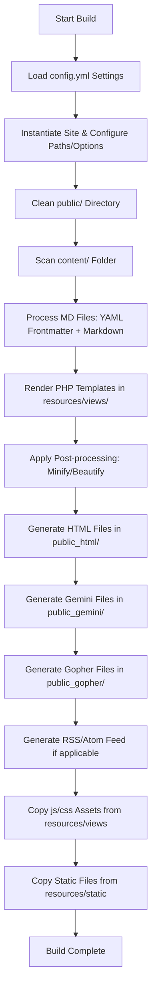

# Project Architecture

This document describes the high-level architecture and folder structure of the Indieinabox static site generator.

## Build Pipeline Flow

Indieinabox is a lightweight static site generator. The build pipeline is executed via CLI by running `build.php`. Below is a visualization of the pipeline flow:

## Directory Structure

Here is a breakdown of the workspace layout and its main contents:

- **`app/`**: Object-oriented, namespaced code representing generator components (Page, Site, etc.) mapped to the `Indieinabox\` namespace under PSR-4.
  - **`functions/`**: Procedural code containing fallback utility functions and file writers.
- **`bootstrap/`**: Application bootstrapper.
  - **`app.php`**: Registers the autoloader and procedural helpers/data files.
- **`content/`**: Contains the input Markdown and plain text source files representing your content. They are parsed and structured hierarchically.
- **`data/`**: PHP arrays acting as dynamic configuration/translation tables (e.g., Unicode character mappings, translation tables, international localized strings).
- **`build.php`**: Entry point orchestrating static site generation.
- **`resources/`**: Frontend design assets and templates.
  - **`views/`**: Contains layout layouts, headers, and footer inclusions (PHP/HTML templates) used to format the visual style of pages.
  - **`static/`**: Contains static assets that are copied directly to the output directory.
- **`_theme/`**: Front-end build tools (PostCSS, Webpack) and source assets.
- **`public_html/`**: Generated static HTML pages and compiled assets written here at the end of the build pipeline.
- **`public_gopher/`**: Generated static Gophermap pages written here.
- **`public_gemini/`**: Generated static Gemini (`.gmi`) pages written here.
- **`docs/`**: Documentation files describing the codebase structure and roadmap.
- **`tests/`**: Unit and integration test suites using Pest PHP.

## New Feature Notes

* **Image Dithering:** All images (like photos) copied from `content/` will be processed and dithered into a global palette GIF and a small thumbnail.
* **Interactions:** The SiteBuilder tracks Webmentions/Interactions (like, repost, reply). Interaction counts are always shown, even when 0.
* **Dynamic Indexing:** Category indexes and timelines are compiled natively, creating fully populated indexes for every configured site `kind` in all active languages.
