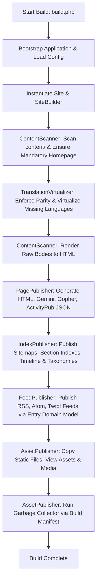

# Project Architecture

This document describes the high-level architecture, pipeline flow, and directory structure of the Indieinabox static site generator.

## Build Pipeline Flow

The static site generator build pipeline is executed via CLI by running `build.php`. `SiteBuilder` serves as the high-level orchestrator, coordinating dedicated domain services:

```mermaid
graph TD
    A[Start Build: build.php] --> B[Bootstrap Application & Load Config]
    B --> C[Instantiate Site & SiteBuilder]
    C --> D[ContentScanner: Scan content/ & Ensure Mandatory Homepage]
    D --> E[TranslationVirtualizer: Enforce Parity & Virtualize Missing Languages]
    E --> F[ContentScanner: Render Raw Bodies to HTML]
    F --> G[PagePublisher: Generate HTML, Gemini, Gopher, ActivityPub JSON]
    G --> H[IndexPublisher: Publish Sitemaps, Section Indexes, Timeline & Taxonomies]
    H --> I[FeedPublisher: Publish RSS, Atom, Twtxt Feeds via Entry Domain Model]
    I --> J[AssetPublisher: Copy Static Files, View Assets & Media]
    J --> K[AssetPublisher: Run Garbage Collector via Build Manifest]
    K --> L[Build Complete]
```

## Modular Service Architecture

The core generation pipeline is decoupled into single-responsibility services:

- **`ContentScanner`**: Traverses the content filesystem, initializes parser pipelines, ensures root homepages, and renders raw Markdown page bodies into HTML.
- **`TranslationVirtualizer`**: Audits language completeness and automatically generates pseudo-translated page stubs for missing translations.
- **`PagePublisher`**: Publishes individual page documents simultaneously across modern and retro protocols (HTML, Gemini `.gmi`, Gopher `gophermap`, ActivityPub JSON).
- **`IndexPublisher`**: Generates sitemaps, monthly chronological section archives, tag and digital garden taxonomy index pages, and custom timeline pages.
- **`FeedPublisher`**: Transforms universal `Entry` entities into syndicated feeds (RSS, Atom, Twtxt) via pluggable `FeedGeneratorInterface` implementations.
- **`AssetPublisher`**: Copies static files, extracts theme view assets, synchronizes media libraries, and prunes orphaned files using the build manifest.
- **`ThemeManager`**: Resolves, compiles, and renders layout templates and partials from disk or compiled `DefaultTheme` fallbacks.

## Directory Structure

Here is a breakdown of the workspace layout and its main contents:

- **`app/`**: Object-oriented, namespaced code under PSR-4 (`Indieinabox\`).
  - **`Core/`**: Core infrastructure including PSR-11 Dependency Injection `Container` with autowiring, and exception contracts.
  - **`Console/`**: Command-line interface kernel, command contract, and dedicated single-responsibility commands (`BuildCommand`, `CronCommand`, `FetchCommand`, `PostCommand`, `ProfileCommand`, `ConfigCommand`, `SetupCommand`, `LinkCheckCommand`, `BackupCommand`, `TestWebmentionCommand`, `VersionCommand`, `UpdateCommand`).
  - **`Federation/`**: Multi-protocol federation subsystem and adapters implementing `FederationAdapter`:
    - `Contracts/FederationAdapter.php`: Universal protocol adapter contract (`getProtocol`, `supports`, `buildLikeActivity`, `buildReplyActivity`, `buildFollowActivity`, `deliverActivity`, `parseActivity`).
    - `ActivityPubAdapter.php`: W3C ActivityPub / ActivityStreams 2.0 implementation with HTTP Signatures and custom transport support.
    - `FederationManager.php`: Protocol registry, resolver, and adapter orchestrator.
  - **`Services/`**: Protocol-agnostic domain business services:
    - `FollowService.php`: Remote follower management, status checks, and distinct fan-out inbox resolution.
    - `OutboxService.php`: Outgoing delivery queueing, follower broadcast fan-out, and adapter-based delivery dispatch.
    - `InboxService.php`: Incoming activity queueing, follow/accept orchestration, and undo-follow processing.
    - `PublishPostService.php`: Note/article creation, markdown persistence, static site compilation, and federation broadcasting.
  - **`Entry/`**: Universal `Entry` domain model for feed items, posts, and federation.
  - **`SiteBuilder/`**: Core site generation services (`ContentScanner`, `TranslationVirtualizer`, `PagePublisher`, `IndexPublisher`, `FeedPublisher`, `AssetPublisher`).
  - **`Feeds/`**: Feed generator interfaces and format implementations (`Rss`, `Atom`, `Twtxt`).
  - **`Markdown/`**: Custom AST parser, processors, validators, and protocol renderers (HTML, Gemtext, Gophermap).
  - **`Theme/`**: Theme metadata, SEO helpers, and microformats components.
  - **`Support/`**: Domain utilities (`TextParser`, `DateFormatter`, `HtmlUtils`, `FileUtils`).
  - **`Taxonomy/`**: Kind helpers and post categorization services (`KindHelper`).
  - **`Localization/`**: Translation services (`Translator`).
  - **`Media/`**: Dithering and image generation services (`ImageProcessor`).
  - **`functions/`**: Procedural helpers and utility functions.
- **`bootstrap/`**: Application bootstrapper.
- **`content/`**: Markdown and plain text source files.
- **`data/`**: SQLite database, cached mentions, and application state.
- **`build.php`**: Entry point orchestrating static site generation.
- **`resources/`**: Theme templates (`views/`) and static assets (`static/`).
- **`public_html/`**: Static HTML output and assets.
- **`public_gopher/`**: Static Gophermap output.
- **`public_gemini/`**: Static Gemini (`.gmi`) output.
- **`docs/`**: Technical documentation and API specifications.
- **`tests/`**: Unit, integration, and functional test suites using Pest PHP.

## Feature Notes

* **Universal Entry Entity:** All feeds, timelines, and federated items share the same domain entity model (`Indieinabox\Entry\Entry`).
* **Offline-first Admin UI:** The admin panel never makes blocking external network requests during page load. All federation, webmentions, and updates run asynchronously.
* **Image Dithering:** Embedded photos are automatically processed and dithered into bandwidth-efficient global palette GIFs and thumbnails.
* **Multi-protocol Publishing:** Every content piece is natively published for the Web (HTML + microformats2 + ActivityPub), Gemini, and Gopher.
