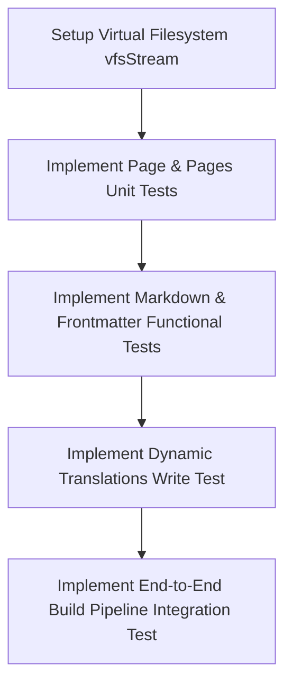

# Missing Tests Audit: Unit, Functional & Integration

This document outlines the current test coverage gaps in the Indieinabox static site generator and details a roadmap of missing unit, functional, and integration tests to ensure long-term stability and compatibility.

---

## 📊 Summary of Current Test Coverage

The project currently has a basic suite of unit tests located in `tests/Unit/`. The active tests cover:
- **`Site` Configuration Components**: Defaults and custom parameters for `Localization`, `Metadata`, `Options`, `Paths`, `Support`, and the root `Site` class.
- **Routing Translations**: `UrlTranslations` slug translation lookup.

**Remaining Gaps**: All core page processing classes, procedural utility functions, markdown processors, and build pipelines have **zero test coverage**.

---

## 🧪 1. Missing Unit Tests

### Core Engine Classes (`app/`)
- **`Page` (`app/Page.php`)**:
  - Test instantiation with defaults and custom components.
  - Test dynamic getter shortcut behaviors (e.g. `$page->lang` returning `$page->localization->lang`).
  - Test dynamic ISO-8601 formatting of dates (`$page->isodate`).
  - Test `Content` casting to string (checking that `(string) $page->content` matches the rendered HTML).
- **`Pages` Collection (`app/Pages.php`)**:
  - Test adding a `Page` object with implicit slug identifier.
  - Test adding a `Page` as array (legacy compatibility bridge).
  - Test retrieve and overwrite offsets (`ArrayObject` table bindings).
- **`Yaml` Parser (`app/Yaml.php`)**:
  - Test parsing YAML frontmatter strings into associative arrays.
  - Test saving/dumping arrays back into YAML formatting.
- **`Helper` Class (`app/Helper.php`)**:
  - Test date localization maps and string sanitization shortcuts.
- **Namespaced Markdown Parsers**:
  - **`Markdown\FileProcessor`**: Test extension validation against support lists and layout template file resolution.
  - **`Markdown\ContentProcessor`**: Test frontmatter extraction, inline hashtag parsing (`#tag`), and Parsedown bridge execution.
  - **`Markdown\LanguageProcessor`**: Test active locale determination and slug translations.

---

## ⚙️ 2. Missing Functional Tests

Functional tests verify specific features or business rules within isolated subsystems.

- **Translation Engine Auto-Update (`app/functions/translate.php`)**:
  - Test that calling `translate("New String", "es")` when the string is missing dynamically writes the new key back to the dictionary file `data/translations.php` and alphabetizes the array.
- **Post Classification (`app/functions/kind.php`)**:
  - Test that the generator correctly classifies a page's kind (e.g., photo, note, reply, article) based on the presence of specific metadata fields (like `photo`, `reply-to`, or title content length).
- **Date Localization (`app/functions/date.php`)**:
  - Test localized date formats for Portuguese (`pt-br`), English (`en`), and Spanish (`es`) using mock timestamps.
- **Tag Extraction (`app/functions/parse.php`)**:
  - Test that inline hashtags (e.g. `Hello #world`) are parsed out of the text, cleaned of special characters, and appended as lowercase array values to the page's `$page->tags` array.
- **HTML Beautification / Minification (`app/functions/general.php`)**:
  - Test that `minifyhtml()` correctly removes comments/whitespace when `htmlpostprocessing` config is set to `"minify"`.
  - Test that `beautifyhtml()` correctly formats layout code when `htmlpostprocessing` config is set to `"beautify"`.

---

## 🔗 3. Missing Integration Tests

Integration tests verify that multiple subsystems (the file system, configurations, views, and CLI executors) operate correctly together.

- **Static Site Build Pipeline (`build.php` / `indieinabox.php`)**:
  - Set up a temporary mock directory structure containing a `config.yml`, sample templates in `resources/views/`, and a few Markdown posts in `content/`.
  - Execute the compilation pipeline (`php build.php` and `php indieinabox.php`).
  - Verify that the target `public/` directory is cleaned and repopulated.
  - Assert the index pages contain successfully compiled HTML matching the views.
- **Dev Mode Live-Reload Injection**:
  - Run the build with the `-d` CLI option.
  - Verify that the generated output HTML files contain the live-reload script `live.js` included inside their `<head>` tag.
- **Static Asset Copying**:
  - Assert that files under `resources/static/` are correctly copied over to the output directory, preserving folder hierarchies.
- **RSS/Atom Feed Generation (`app/functions/generate.php`)**:
  - Run the generator and verify that `public/feed.xml` is generated, parses as valid XML, and includes correct post summaries.

---

## 🗺️ Proposed Testing Roadmap

To implement these tests systematically, we recommend the following approach:

1. **vfsStream Setup**: Use the `mikey179/vfsStream` package in `require-dev` to mock directories and filesystems. This avoids actual disk reads/writes during test executions (ideal for testing file processors, translations, and templates loading).
2. **Phase-by-Phase Coverage**: Prioritize tests in order of core logic importance (first `Page`/`Parser`, then helper functions, then the build pipeline).
